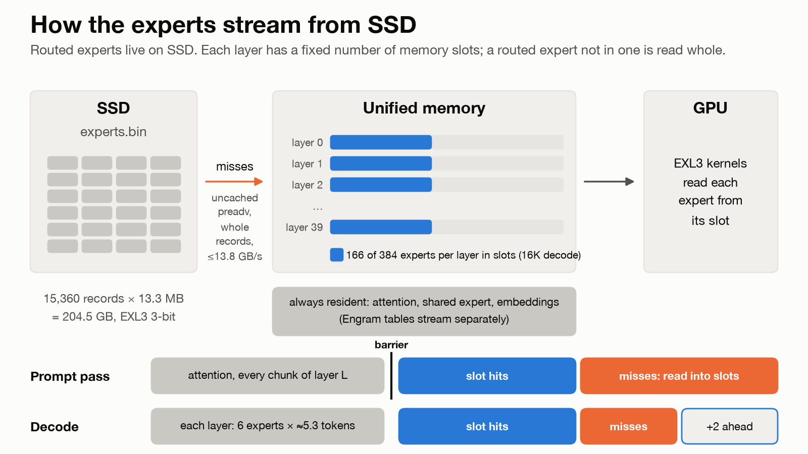
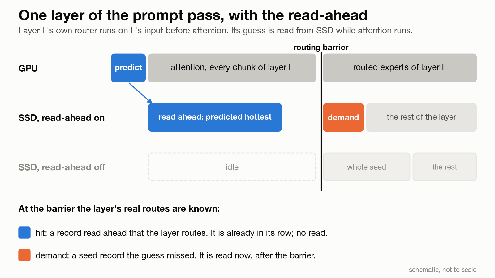
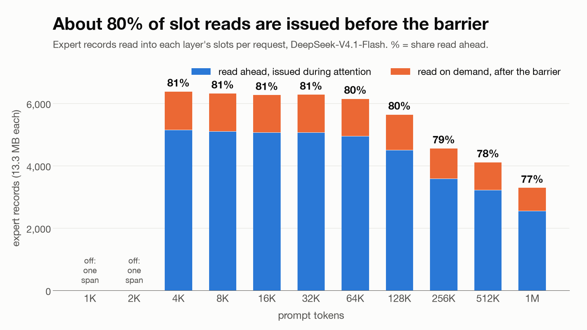

# Guessing MoE experts before attention, so SSD reads overlap compute

*David Tai, October 2026*

DeepSeek-V4.1-Flash streams its experts from SSD. Each MoE layer's router used to wait for attention. Now it runs first, so expert reads start early. At 16K tokens, 81% of the reads that fill each layer's resident expert slots are issued before its routes are known.

## How the experts stream from SSD

The model has 40 MoE layers of 384 routed experts. Each token routes to 6, plus a shared expert. The routed experts fill one 204.5 GB file: 15,360 records of 13.3 MB, 3-bit EXL3. Attention, the shared expert and the embeddings stay in memory.

Each layer gets fixed expert slots, sized at startup to keep the machine 2 GiB under its 112 GiB GPU limit. At 16K: 135 per layer for the prompt, 166 for decode. Any other routed expert is read whole from SSD, uncached, at up to 13.8 GB/s. The prompt pass refills slots layer by layer, reading 206 GB at 16K. Decode reads its misses plus two records ahead, once per verify step of about 5.3 tokens.

## Score each layer's router before its attention

The predictor needs no training. In the prompt pass, before layer L's attention, layer L's router scores the layer's input, normed with the MoE's RMSNorm weight. That approximates the MoE input before attention's update. Each token's top 6 experts are counted across the prompt, and the hottest are read into the layer's empty slots.

Decode looks one layer further ahead. Layer L+1's router scores layer L's MoE input, and two records start reading.

## The SSD sat idle through attention

In the 16K profile taken before this change, the prompt read 186 GB of expert records. A layer could start its reads only at its routing barrier, the point where every chunk of the prompt has finished attention and the real routes are known. The SSD sat idle while attention ran, and 11.5 s of the 42.6 s prompt pass was spent waiting on reads. Moving a read earlier means guessing the expert first.

## The barrier sorts hits from demand reads

The guesses are issued to the SSD reader and land only in empty rows, so they never evict anything. At the barrier:

- **hit:** a record read ahead that the layer routes. It's already in its row, so no read is issued.
- **demand:** a record the read-ahead didn't cover, either because the guess missed it or because no empty row was left. It's read after the barrier.

The guesses only choose when reads start. The bytes a row serves are the same record either way.

## 81% of reads issued early at 16K, 77% at 1M

At 16K, 5,056 records (67.3 GB) were issued ahead and 1,211 were read on demand. Prompts of 1K and 2K run as one span, so the predictor doesn't run for them.

Hits were 5,048 of 5,056. That rate flatters the predictor, because a 16K prompt routes about 95% of all experts. In the release that added it, 16K prefill rose from 430.9 to 475.2 tok/s (+10.3%). That release also added a third read window, so the predictor's share of the gain wasn't measured on its own.

## Under a second per prompt, no new expert memory

The prompt-pass predictor runs one router matmul per chunk, four chunks per GPU round trip. It took 0.6 to 0.75 s in the 16K profiles, with 25 MB of temporary memory per chunk (100 MB per batch). Its guesses fill slots that are already reserved, so a wrong guess costs only bandwidth.

Decode reserves 54.5 MB of read buffers, room for four records, twice its two-record budget. The host picks those records from at most 64 candidates: 8 verify tokens, top 8 experts each.

## Prior art and code

The predictor is Eliseev & Mazur, [arXiv:2312.17238](https://arxiv.org/abs/2312.17238): the next layer's gate applied to the current hidden state. Exact speculative prefetch is established work. The decode issue policy follows ProMoE ([arXiv:2410.22134](https://arxiv.org/abs/2410.22134)), and HOBBIT ([arXiv:2411.01433](https://arxiv.org/abs/2411.01433)) looks two or three layers ahead. Our part is the prompt-pass variant and a measured prefill gain from SSD prefetch on a Mac.

Code at 29c3d43:

- `src/sdk_ext/expert/io.zig:216`: the uncached SSD reader
- `src/sdk_ext/expert/policy.zig:332`: slot residency per layer
- `src/deepseek_v41_bill.zig:455`: the memory bill that sizes the slots
- `expert-manifest-v2.json` (model directory): record geometry
- `src/deepseek_v41_graph.zig:2078`: the predictor
- `src/deepseek_v41_model.zig:713`: the prompt-pass driver, called at :836
- `src/sdk_ext/expert/stream.zig:746,1029,1094`: barrier, issue, land
- `src/sdk_ext/expert/lookahead.zig:56`: decode selection

---

Receipts (one native served request per row):

- Ladder: `reports/dsv41-f39-tcq3-runtime/mlx-serve-phase2/cx11-runs/cx2-20261006-214409/rows.txt`
- Slots, bill target and the 206 GB prompt read: `mlx-serve-phase2/ex-runs/ex-20261006-044335/headline.log`
- Before profile and release step: `mlx-serve-phase2/p1-cross-layer-read-ahead-20260930.md` and `integration-lane-note-20260930.md`
